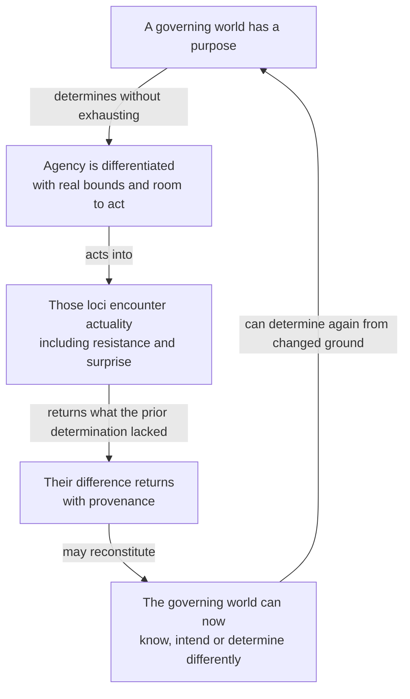
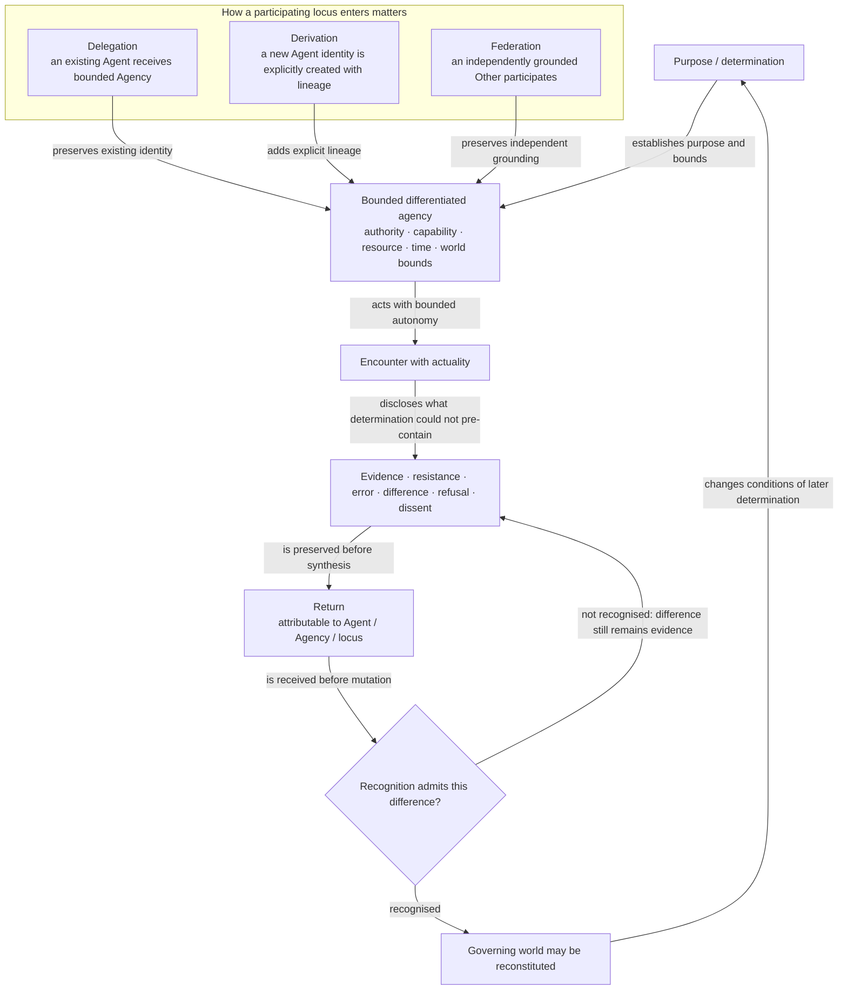
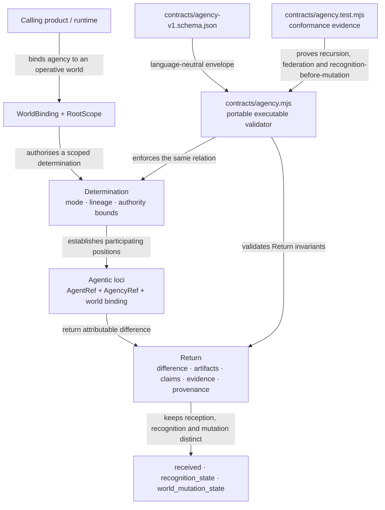

# Actuation Visual Product Understanding

**Status:** canonical product-understanding surface  
**Architecture status:** accepted `main` after the portable Root Agency / Return convergence  
**Sources:** `ACTUATION-CONSTITUTION.md`, `ACTUATION-RELATION.md`, `WORLD-BOUND-ROOT-AGENCY.md`, `contracts/agency-v1.schema.json`, `contracts/agency.mjs`, and their conformance tests.

Actuation exists because purposeful agency is incomplete if determination only travels downward. Differentiated agency is valuable precisely because it can encounter a reality the governing position did not already contain and return attributable difference.

## 1. Experience — agency can meet something real and come back changed

The human or agent does not merely get more workers. It gains a bounded plurality whose encounter with actuality can matter to the world that commissioned it.

## 2. Product / conceptual relation — downward authority requires upward reality

This is the reason behind the constitutional law. **Downward authority requires upward reality because the point of differentiated agency is to encounter conditions outside the governing determination; without an admissible return, authority can dispatch action but cannot be corrected by what action discovers.**

Federation is not a decorative fourth entry mode. Delegation changes the situated authority of an already-existing Agent; derivation explicitly creates a new enduring identity; federation brings an independently grounded participant into the composition without pretending that the governor authored or owns that Other.

## 3. Architecture — current portable authority and Return contract

The accepted implementation is intentionally portable and material-neutral. AIKit may later resolve a body/session/Surface and Workcell may materialise processes and services, but neither transport nor body identity changes the Actuation relation by itself.

## 4. Diagram audit

| Existing visual | Class | Disposition |
|---|---|---|
| `ACTUATION-CONSTITUTION.md` intention → determination → autonomy → encounter → difference → return → reconstituted world | conceptual | **Superseded as the canonical first conceptual visual** by the diagram above, which makes the reason for the return and recognition boundary explicit. Preserve the constitutional prose. |
| `ACTUATION-RELATION.md` `g → C(L) → ΔW → g` circuit | specialist conceptual/formal | **Preserve.** It is the concise relational notation once the reader understands the product meaning. |
| recursive governance examples in `ACTUATION-RELATION.md` | specialist conceptual | **Preserve.** They explain scoped recursion, not first-contact purpose. |
| `ACTUATION-RELATION.md` intent → Actuation → execution demand → AIKit → Workcell → evidence → Return | cross-product architecture | **Preserve with boundary status.** It explains interoperability but must not be mistaken for Actuation's own implementation stack. |
| QL runtime migration/experiment diagrams | research / specialist architecture | **Preserve as experimental.** They do not define generic Actuation identity. |

## 5. Verification

**Semantic:** the conceptual diagram shows why the many are differentiated and why the upward path is constitutive rather than a callback. Important arrows name determination, autonomy, encounter, disclosure, return, recognition, and reconstitution.

**Implementation:** the architecture is grounded in the accepted `actuation.agency/v1` schema/module/tests. It does not claim a live universal orchestrator, provider, harness, or Workcell.

**Cross-product:** Actuation owns first-class situated agency and return. AIKit resolves the operative body/world; Factory gives agency a developmental reason in a Run; Workcell materialises computation. None of those distinctions are collapsed.

## 6. Public-site projection

The public/design surface should project the **experience circuit** and, one level deeper, the conceptual Return diagram. The architecture contract diagram belongs in technical docs. Do not publish “downward authority requires upward reality” alone: the visual must preserve the relation that gives the phrase meaning.